**AIM** : Prototype Development ***\_\_\_\_\_\_\_\_\_\_\_\_\_\_\_\_\_\_\_\_\_\_\_\_\_\_\_\_\_\_\_\_\_\_\_\_\_\_\_\_\_\_\_\_\_\_\_\_\_\_\_\_\_\_\_\_\_\_\_\_\_\_\_\_\_\_\_\_\_\_\_\_\_\_\_*** 

Abstract:  

This PHP-driven web application is designed to streamline and enhance the management of product records within a company's database system. Leveraging PHP in conjunction with MySQL, the application orchestrates Create, Read, Update, and Delete (CRUD) operations seamlessly.** 

Its comprehensive functionalities encompass: 

- **Product Registration**: Facilitates the addition of new products into the database, capturing vital details such as product name, type, pricing information, market values, currency, and units. 
- **Dynamic Data Presentation**: Renders product data dynamically in a structured tabular layout, ensuring an organized and accessible display of product information. 
- **Editing Capabilities**: Empowers users to modify existing product records via intuitive modal interfaces. Pre-filled with relevant details, these modals streamline the editing process, enhancing user efficiency. 
- **Deletion Functionality**: Provides users with the ability to remove individual product entries, prompting confirmation to ensure deliberate actions. 
- **Interactive Features**: Implements JavaScript functionalities to enhance user interaction, including confirmation prompts for deletion actions and utilization of DataTables for optimized table formatting. 

Employing PHP's robust mysqli functions, the system executes SQL queries, ensuring secure and efficient database operations. By integrating HTML forms and Bootstrap for a user- friendly interface, this application emerges as an invaluable asset for expeditious and structured product management within an organizational inventory system.  

Resources 

1)  XAMPP  

**Installing XAMPP** 

Our XAMPP tutorial will take you through the installation process for the software package on Windows. If you’re using Linux or Mac OS X, then the steps listed below for the installation process may differ. 

***Step 1: Download*** 

XAMPP is a release made available by the non-profit project Apache Friends. Versions with PHP 5.5, 5.6, or 7 are available for download on the[ Apache Friends ](http://www.apachefriends.org/de/download.html)website. 

***Step 2: Run .exe file*** 

Once the software bundle has been downloaded, you can start the installation by double clicking on the file with the ending[ .exe.](https://www.ionos.com/digitalguide/server/know-how/exe-file/) 

***Step 3: Deactivate any antivirus software*** 

Since an active antivirus program can negatively affect the installation process, it’s recommended to temporarily pause any antivirus software until all XAMPP components have successfully been installed. 

***Step 4: Deactivate UAC*** 

User Account Control (UAC) can interfere with the XAMPP installation because it limits writing access to the C: drive, so we recommend you deactivate this too for the duration of the installation process. 

***Step 5: Start the setup wizard*** 

After you’ve opened the .exe file (after deactivating your antivirus program(s) and taken note of the User Account Control, the start screen of the XAMPP setup wizard should appear automatically. Click on ‘Next’ to configure the installation settings. 

***Step 6: Choose software components*** 

Under ‘Select Components’, you have the option to exclude individual components of the XAMPP software bundle from the installation. But for a full local test server, we recommend you install using the standard setup and all available components. After making your choice, click ‘Next’. 

***Step 7: Choose the installation directory*** 

In this next step, you have the chance to choose where you’d like the XAMPP software packet to be installed. If you opt for the standard setup, then a folder with the name XAMPP will be created under C:\ for you. After you’ve chosen a location, click ‘Next’. 

***Step 8: Start the installation process*** 

Once all the aforementioned preferences have been decided, click to start the installation. The setup wizard will unpack and install the selected components and save them to the designated directory. This process can take several minutes in total. You can follow the progress of this installation by keeping an eye on the green loading bar in the middle of the screen. 

***Step 9: Complete installation*** 

Once all the components are unpacked and installed, you can close the setup wizard by clicking on ‘Finish’. Click to tick the corresponding check box and open the XAMPP Control Panel once the installation process is finished. 

2)PHP MyAdmin   

- Navigate to XAMPP Control Panel. Start Apache and MySQL modules.  
- Click on Admin button next to MySQL ‘stop’.  
- You will get redirected directly to phpMyAdmin.  
- Go to databases and create your own database. 

3)Data-tables   

DataTables is a plug-in for the jQuery Javascript library. It is a highly flexible tool, built upon the foundations of progressive enhancement, that adds all of these advanced features to any HTML table.  

4)Bootstrap CSS  

Bootstrap is a free and open-source CSS framework directed at responsive, mobile-first front- end web development. It contains HTML, CSS and JavaScript-based design templates for typography, forms, buttons, navigation, and other interface components. 

Connecting Database to webpage  

Once we create the required database, the next step is to connect the database to our webpage. We execute this using php’s in-built functions of ‘mysqli\_connect()’. This function takes in server name , username , password and database name as a parameter.  

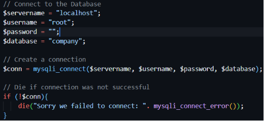
We have performed simple Insert , Update and Delete operations in our database by using php’s in-built function ‘mysqli\_query()’. This function takes connection variable and SQL query variable as a parameter.  

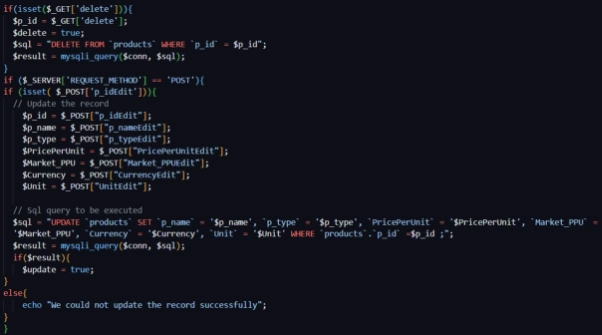

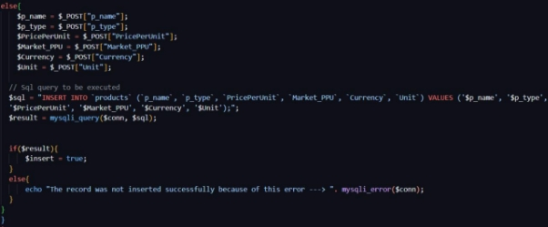

We have used $insert , $update and $delete variables to keep track whether our queries are executed or not. We throw an alert according to the result to acknowledge the same.  

DEMO   

The webpage starts from here: 

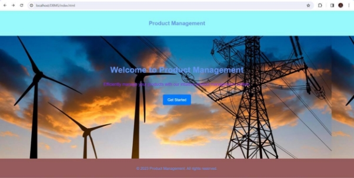

So lets get started!  

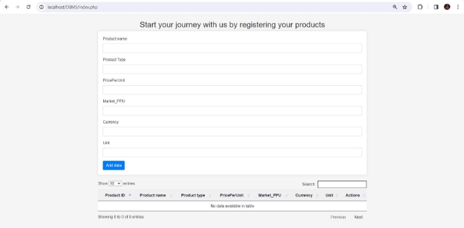

Initially we have no data in our table, so lets add data about some products. 

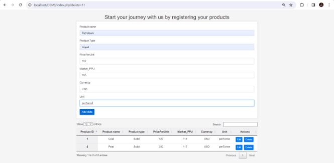

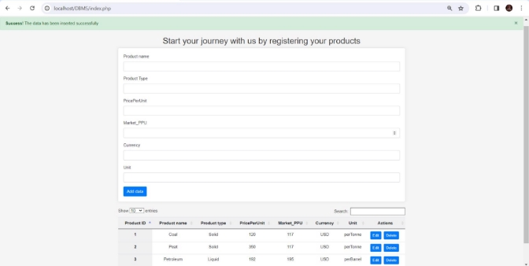

So as we can see we have inserted information about 3 products successfully and that is reflected in the data table below the input form which reflects the current database. Let us also verify this in our database 

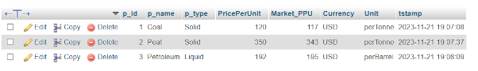

Hence insert operation is verified.   

Lets proceed to Update operation. As the name suggest we will update a few details in our database and observe the changes. In our webpage we have provided a Edit option to perform the update operation using a modal. When we click edit button a pop-up appears asking us to fill the new details.  

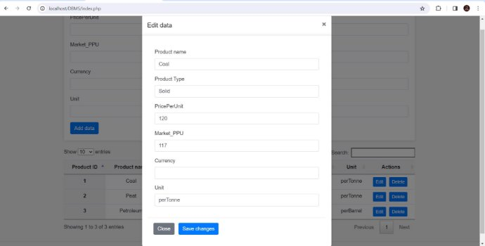

Let us update a few details and save the changes 

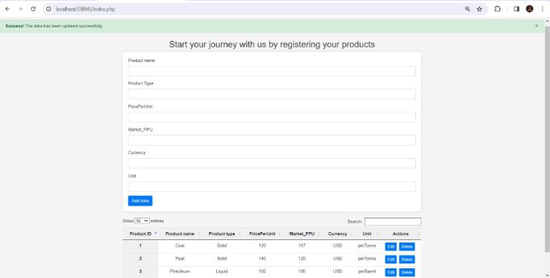

Database is as follows: 

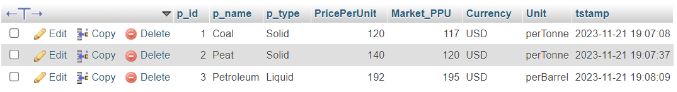

Now lets see how delete operation takes place. Similar to edit, we have provided a delete button to delete the record. We also ask the confirmation from the user before deleting the record.  

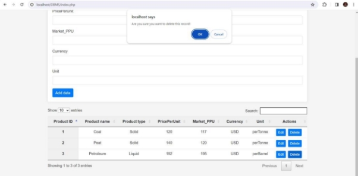

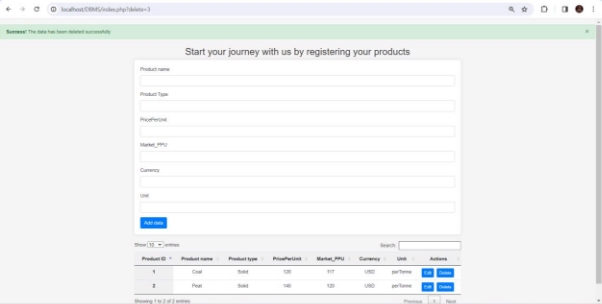

Database is as follows:

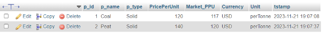

**Conclusion:** 

We have verified simple Insert , update and delete in our database through a web page. We have successfully developed a prototype. 
